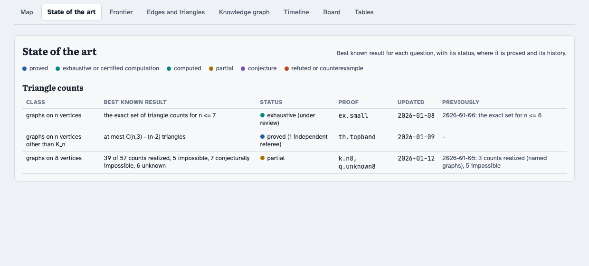
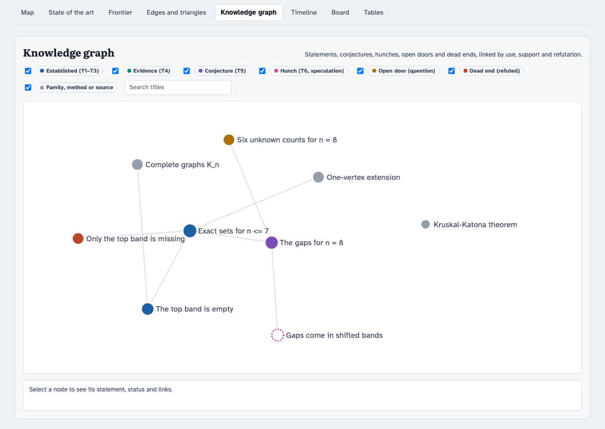
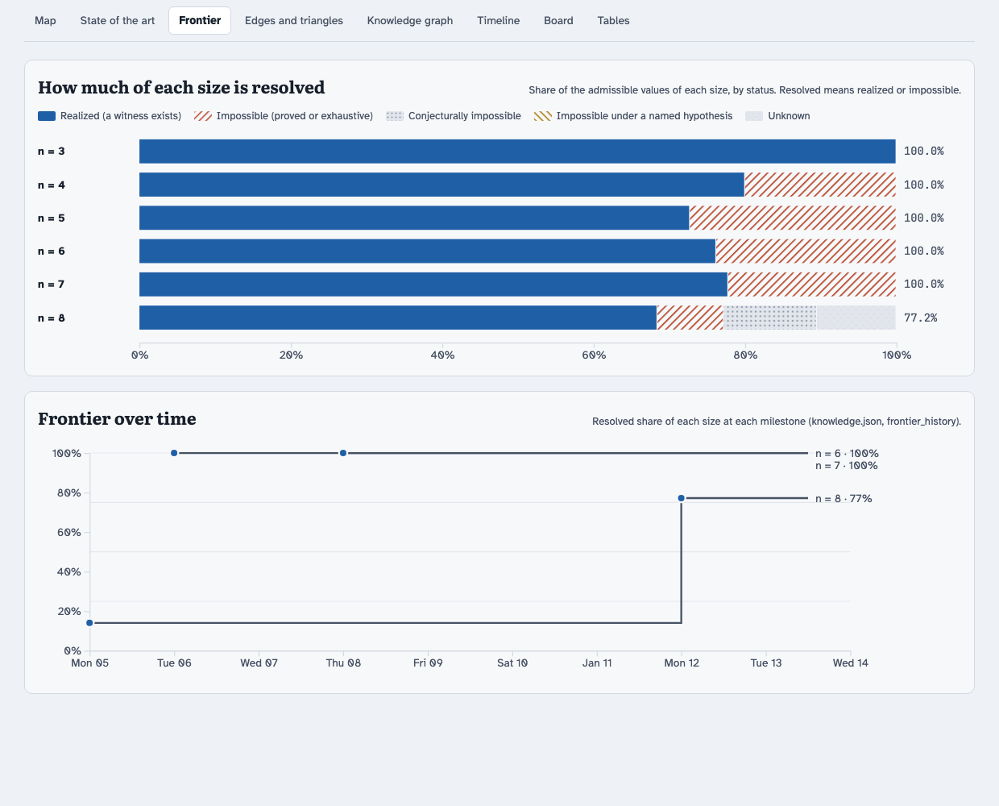

<p align="center">
  
</p>

<p align="center">
  <a href="https://github.com/nasqret/labyrinth-exploration/actions/workflows/tests.yml"></a>
  <a href="LICENSE"></a>
  
</p>

# Labyrinth exploration

**A [Claude Code](https://claude.com/claude-code) skill for open-ended research**: mathematics,
theoretical science, algorithms, anywhere the goal is to find out what is still unknown.

The skill treats a research programme as the exploration of a labyrinth. Claude keeps an
exact map of where you are:
- which corridors are charted (proved, or computed exhaustively);
- which are walled off (refuted, or impossible);
- which doors are visible but not yet entered (questions, conjectures);
- where it is still dark.

Every session starts from that map and leaves it changed. A refutation counts as progress:
it turns a hoped-for corridor into a wall and usually reveals a new door.

- **Proof stays apart from speculation.** Every claim carries a tier, from T1 (proved in the
  literature) to T6 (a hunch). Nothing below T3 is ever cited as a fact, and hunches are kept
  on the board on purpose, clearly marked.
- **"How much is left" becomes a number.** For each size, every admissible value is
  classified as realized, impossible, conditional, conjecturally impossible or unknown. The
  dashboard shows the resolved share and how it moved over time.
- **Nothing is used before it is checked.** Results from agents or external models pass an
  independent referee, with its own code, before they enter the notes.
- **It scales.** For many open problems at once, it runs campaigns: attack agents, a
  literature agent, a referee for every report, writers who draft on a copy, and you (or
  Claude) as the coordinator.

The method was developed on a research programme in pure mathematics in September and
October 2026. The [lessons](references/lessons.md) from that programme are part of the skill.

## Quick start

**1. Install.** Claude Code loads personal skills from `~/.claude/skills/`:

```bash
git clone https://github.com/nasqret/labyrinth-exploration ~/.claude/skills/labyrinth-exploration
```

Start a new Claude Code session. Nothing else is needed: Claude sees the skill's
description and loads it when your request matches (or when you mention the labyrinth).

**2. See a complete map.** The repository includes a small public example: *how many
triangles can a graph on n vertices have?* It builds in seconds and needs only Python 3:

```bash
cd ~/.claude/skills/labyrinth-exploration
mkdir -p /tmp/demo/labyrinth/dashboard
cp templates/lab.py /tmp/demo/labyrinth/
cp templates/dashboard.html /tmp/demo/labyrinth/dashboard/template.html
cp examples/triangle-counts/{knowledge.json,events.jsonl,sota.json} /tmp/demo/labyrinth/
python3 examples/triangle-counts/make_example.py /tmp/demo/labyrinth
cd /tmp/demo && python3 labyrinth/lab.py check && python3 labyrinth/lab.py build
open labyrinth/dashboard/index.html        # or xdg-open on Linux
```

<p align="center">
  
</p>

**3. Use it on your own question.** In Claude Code, describe the programme, for example:

> I want to understand which values the crossing number takes on cubic graphs of each size.
> Map what is known, set up the labyrinth for this project, and push the bounds.

Claude reads the skill and sets up `labyrinth/` in your repository. It then works in the
loop below and leaves a dashboard and a state-of-the-art table behind. More prompts are in
[`examples/prompts.md`](examples/prompts.md).

## How it works

<p align="center">
  
</p>

Each iteration picks one to three doors and explores them with several tool families at
once: literature sweeps in the background, small computations, extreme and named examples.
It then states a bold conjecture *with its test*, runs the test, logs the outcome, has it
refereed, and updates the map. A refuted claim becomes a dead end with a one-line lesson,
followed by the modified statement. When the map stops changing, an escalation ladder takes
over: change the tools, the parameter or the extremes, relax a hypothesis, invert the
question, import from another community, or launch a broad attack.

The [tutorial](docs/tutorial.md) walks through all of this step by step, on the example.

### The map

| artifact | file | what it holds |
|---|---|---|
| knowledge graph | `labyrinth/knowledge.json` | results, conjectures, hunches, open doors, dead ends, families, methods, sources, with typed links |
| event log | `labyrinth/events.jsonl` | every discovery, the moment it happens |
| frontier map | `labyrinth/frontier.json` | for each size, the status of every admissible value (written by your scripts) |
| state of the art | `labyrinth/sota.json` | the best known result for each question, with its history |
| dashboard | `labyrinth/dashboard/index.html` | all of the above, built by `lab.py build` |
| agent archive | `research/agents/<name>/` | every agent's report, verbatim, with its code and its referee |

### Tiers

<p align="center">
  
</p>

### Campaigns

<p align="center">
  
</p>

When there are more open doors than one iteration can enter, the skill runs a campaign. One
attack agent works on each conjecture, trying at least five perspectives. Each report goes
to an independent referee, who returns a verdict per item and corrections ready to apply.
Writers turn refereed results into drafts and exact edits, tested on a copy. The
coordinator reviews everything and integrates it. The
[campaign guide](references/campaigns.md) has the integration checklist and the failure
modes we hit; fill-in briefs are in [`templates/briefs/`](templates/briefs/).

## The example, tab by tab

| state of the art | knowledge graph |
|---|---|
|  |  |
| **board** | **frontier** |
|  |  |

See [`examples/`](examples/) for the example's files, the prompts, and the briefs.

## What is in this repository

```
SKILL.md                    the skill: what Claude reads when the skill triggers
references/                 loaded on demand: the loop, campaigns, compute etiquette,
                            saturation, the schema, lessons from a long programme
templates/lab.py            the engine (standard-library Python): event log, check, build, status
templates/dashboard.html    the dashboard (one HTML file, d3), filled in by lab.py build
templates/briefs/           fill-in briefs for attack agents, referees and writers
examples/                   the runnable example, example prompts
docs/tutorial.md            the step-by-step tutorial
assets/                     the graphics (generated by tools/make_graphics.py) and screenshots
tests/                      tests of the engine and of the skill's internal consistency
```

## Requirements

- Claude Code, for the skill itself. Subagents are used for literature sweeps, referees and
  campaigns.
- Python 3.9 or newer, standard library only, for the engine and the example. The
  optional exhaustive test in the tutorial uses numpy.
- A browser for the dashboard. It loads d3 and its fonts from CDNs.
- Optional: a Slurm cluster for heavy computations (see the
  [compute etiquette](references/compute.md)), LaTeX for notes, and the
  [Artifacts](https://claude.ai) feature to publish the dashboard privately.

## Privacy

The dashboard and the notes of a real programme usually contain unpublished results. The
skill publishes them **privately** only, and it never puts unpublished results into anything
public (a post, a figure, a shared skill) without your consent. This repository contains no
results of the programme it was developed on.

## Contributing and updates

The installed skill is a clone of this repository, so updating it is `git pull`.
[MAINTAINING.md](MAINTAINING.md) describes how changes are made and released. In short:
edit, run the tests, record the change in the [changelog](CHANGELOG.md), push. Issues and
pull requests are welcome.

## License

[MIT](LICENSE) © 2026 Bartosz Naskręcki
